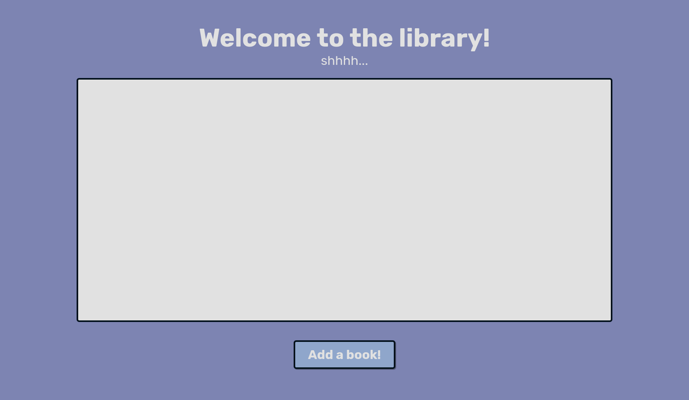

# Odin Library

[Live Link](https://neitodesu.github.io/odin-library/)

## Project layout

1. All books will be stored in an array
2. Use constructor to create new books
3. Use a function (outside of constructor) that will take arguments and create a book object, then store that book object into the library array
   Each book should be created with a unique ID using **`crypto.randomUUID()`**

## Next Steps

1. Use a function that loops through the array and displays each book to the user. Use a "card" display
2. Add a button to make a modal pop up with the form to allow user to submit info(create book object):
   - Author
   - Title
   - of pages
   - If read
3. Add a button on each "card" to remove book from library.
4. Look into data-attributes for the corresponding unique ID
5. Add a button to each "card" to change its 'read status'
